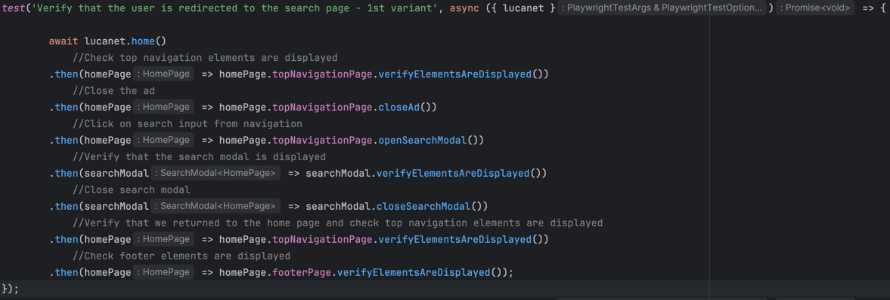

## Lucanet interview Assignment

## Project Overview

This project is built using the following technologies and frameworks:
- TypeScript
- JavaScript
- npm
- Playwright
- Allure

## Prerequisites

Before you begin, ensure you have the following installed on your machine:
- Node.js (https://nodejs.org/)
- npm (comes with Node.js)
- Java (required for Allure)

## Setup Instructions
**Steps**


1. **Clone the repository:**
   ```sh
   git clone https://github.com/alexandru-dan/lucanet-assignment.git
   cd <repository-directory> (where you cloned the repository)
   ```

2. **Install dependencies:**
   ```sh
   npm install
   ```

3. **Install Playwright:**
   ```sh
   npx playwright install
   ```

4. **Install Allure Commandline:**
   ```sh
   npm install -g allure-commandline --save-dev
   ```
## Running Tests

To run the tests, use the following command:
```sh
npx playwright test
```

## Generating Allure Reports

To generate and open the Allure report after running the tests:
```sh
allure generate allure-results --clean
allure open
```
A web page containing the Allure report will open in your default browser.

## Project Structure

- `playwright.config.ts`: Configuration file for Playwright.
- `package.json`: Contains project metadata and dependencies.
- `src/pages/common/BasePage.ts`: Base page class for Playwright tests.
- `README.md`: Project documentation.

## Additional Information

- **Environment Variables:** Ensure to set up the `.env` file with the necessary environment variables.
- **Test Configuration:** Tests are configured to run in parallel with 5 workers and a timeout of 30 seconds per test.
- **Browser Configuration:** Tests are set to run using Chromium (specifically Chrome) with the window maximized.

## Curiously Recurring Template Pattern (CRTP)

This project uses the Curiously Recurring Template Pattern (CRTP). CRTP is a C++ idiom in which a class `Derived` inherits from a class template instantiation using `Derived` itself as a template argument. This pattern allows static polymorphism, enabling the base class to call methods from the derived class without virtual functions.

Example:
```typescript
class BasePage<T extends BasePage<T>> {
    page: Page;

    constructor(page: Page) {
        this.page = page;
    }

    protected async waitForElementToBeVisible(selectorOrLocator: string | Locator): Promise<boolean> {
        if (typeof selectorOrLocator === 'string') {
            return this.page.locator(selectorOrLocator).isVisible();
        } else {
            return selectorOrLocator.isVisible();
        }
    }

    public getThis(): T {
        return this as unknown as T;
    }
}

class DerivedPage extends BasePage<DerivedPage> {
    async specificMethod() {
        // Specific method for DerivedPage
    }
}
```
Using Curiously Recurring Template Pattern (CRTP) will allow us to do actions on some modals(for example) and after we
close them we will be able to continue with the actions on the page that opened the modal.
This makes the code more readable and maintainable, and the tests more easily to write because we can chain the methods. 
Example: 
